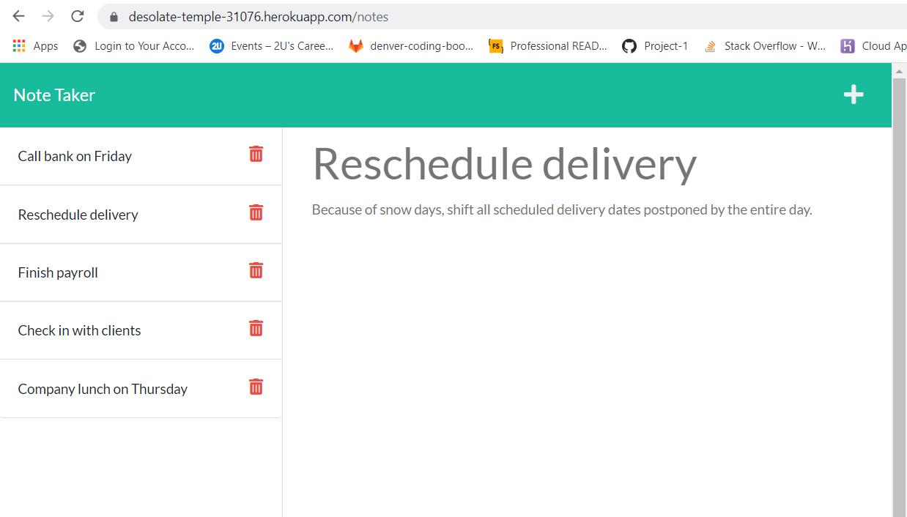

# note-taker-with-express

Bootcamp Week 11: Homework

# 11 Express.js: Note Taker

## Table of Contents 

- [About Task](#about-task)
- [User Story](#user-story)
- [Installation Guide](#installation-guide)
- [My Solution](#my-solution)
- [Samples](#samples)
- [Live](#live)
- [Questions](#questions)

## About Task

This assignment is to modify the starter code to create an application called "Note Taker" that can be used to write and save notes. This application will use an Express.js back end and will save and retrieve note data from a JSON file. My task is to build the back end, connect the two, and then deploy the entire application to Heroku. 

> **Note**: The application’s front end was done. 

Upon launching the Note Taker application, a landing page with a link to a notes page will be uploaded.

The notes page will look like with existing notes listed in the left-hand column, plus empty fields to enter a new note title and the note’s text in the right-hand column.

If you enter a new note title and the note’s text, a Save icon appears in the navigation at the top of the page. When you click on the Save icon, the new note you have entered is saved and appears in the left-hand column with the other existing notes.

All existing note in the list is shown in the left-hand column. Any note is chosen that note appears in the right-hand column.

The Write icon in the navigation at the top of the page is clicked, then empty fields to enter a new note title and the note’s text in the right-hand column will appear.

## User Story

```
AS A small business owner
I WANT to be able to write and save notes
SO THAT I can organize my thoughts and keep track of tasks I need to complete
```

## Installation Guide

This application uses Express.js to build up the back end. It is required to install all necessary dependencies.

First clone the repository then run the following command at the root directory to install the dependencies:

```
npm i
```
    
The application will be invoked by using the following command:
    
```
node server.js
```

A directory structure looks like in the following way:

```
.
├── __db__/                
│   └── db.json                 // db - an array of objects saves notes
├── __helpers__/            
│   ├── fsUtils.js              // module reads, writes and appends file
│   └── uuid.js                 // module creates a unique id 
├── __public__/                 // frond end
|   ├── __assets__/            
│   |      ├── css/style.css    
│   |      └── js/index.js       
│   ├── index.html              // homepage
│   └── notes.html              
├── __routes__/            
│   ├── index.js                // default route
│   └── notes.js                // end route: /api/notes 
├── .gitignore                  // indicates which folders and files Git should ignore
├── package.json                // app dependencies: expressJS, uuid packages
├── README.md           
└── server.js                   // runs the application
```

## My Solution

On the back end, the application includes a `db.json` file that will be used to store and retrieve notes using the `fs` module. Data is stored as an array of objects in db.json file. The "id" property is added in the object to access with a unique value. 

The following HTML routes created in ./routes directory:

* `GET /notes` should return the `notes.html` file. !(notes.js)

* `GET *` should return the `index.html` file. !(index.js)

The following API routes were used:

* `GET /api/notes` read the `db.json` file and returns all saved notes as JSON.

* `POST /api/notes` receives a new note to save on the request body, adds it to the `db.json` file, and then returns the new note to the client. 

* `DELETE /api/notes/:id` receives a query parameter that contains the id of a note to delete. To delete a note, the app needs to read all notes from the `db.json` file, remove the note with the given `id` property, and then rewrite the notes to the `db.json` file.

### Screenshots 

The following image shows the deployed HTML’s appearance: 

## Live

This application is deployed to Heroku.com. Here is a link to the deployed website. [Heroku](https://desolate-temple-31076.herokuapp.com/notes)

## Questions

If you have any questions about the repo, open an issue or contact me directly at naraamtm@gmail.com. Here is a link to this application repo on [Github](https://github.com/Nara1469/note-taker-with-express).
